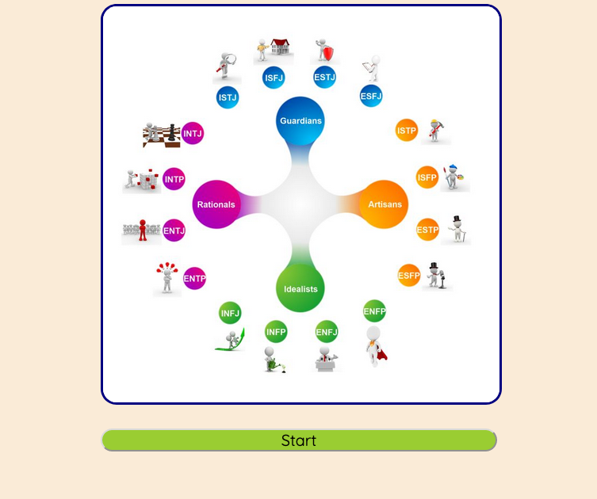
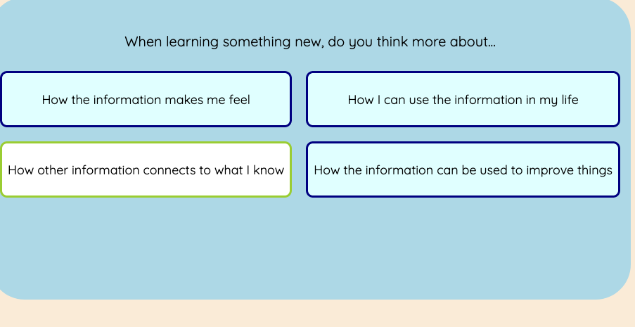
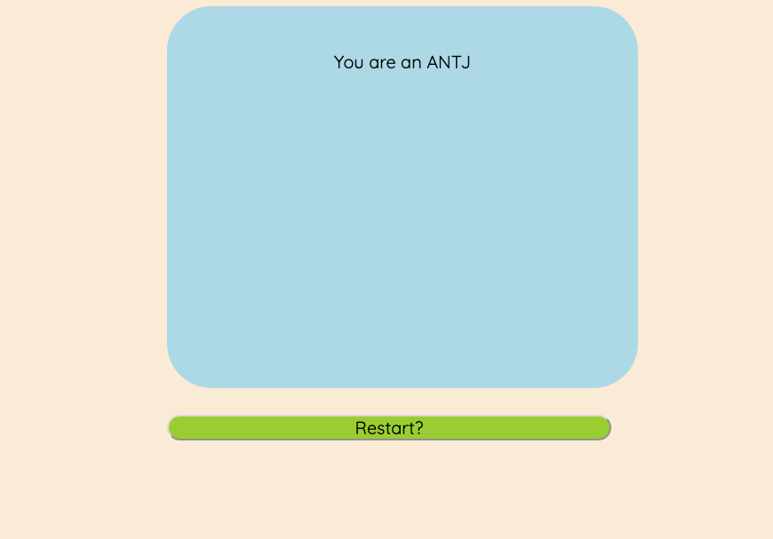

# jQuery-quiz

Quiz using jQuery to animate elements on the page. There are three different screens:

Start Screeen

Test View

and the Results Screen

Buttons will highlight when you hover over the answer before selecting it. Scores are calculated using scales of Sensing-Intuition, Introversion-Extroversion, Thinking-Feeling, and Perceiving-Judging then converted into a four-letter type at the end of the quiz.
